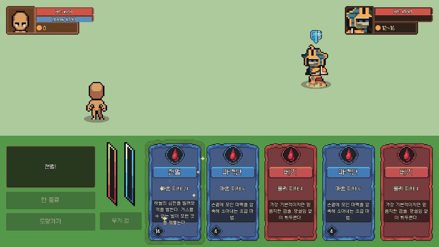
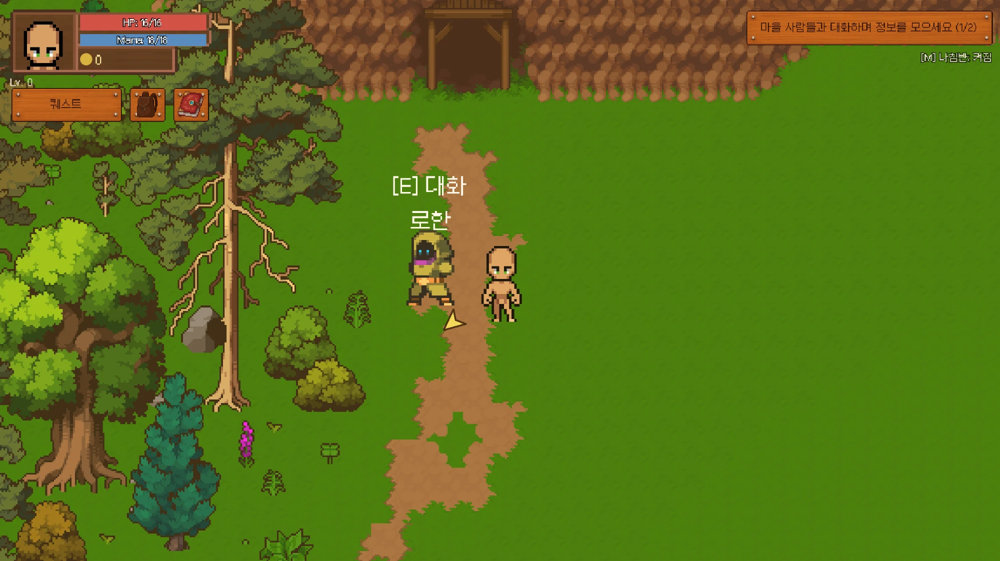
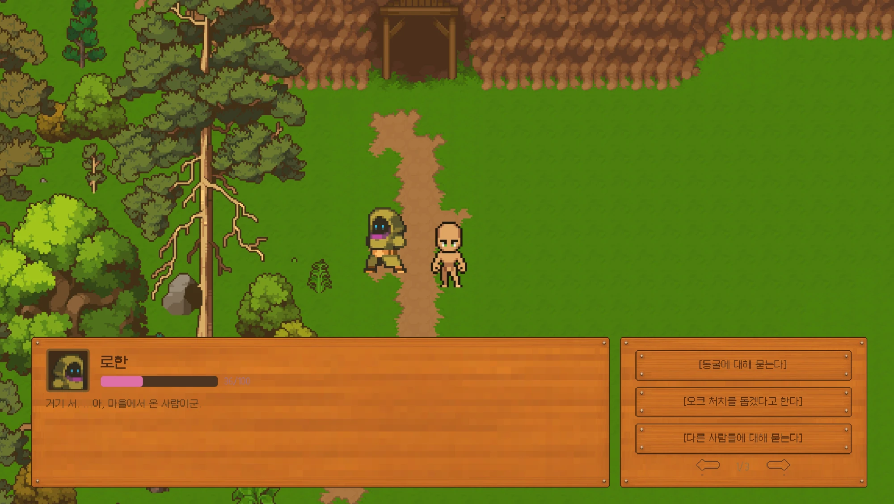
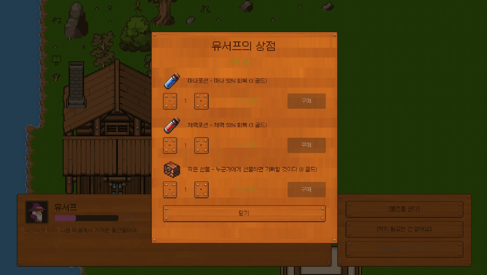
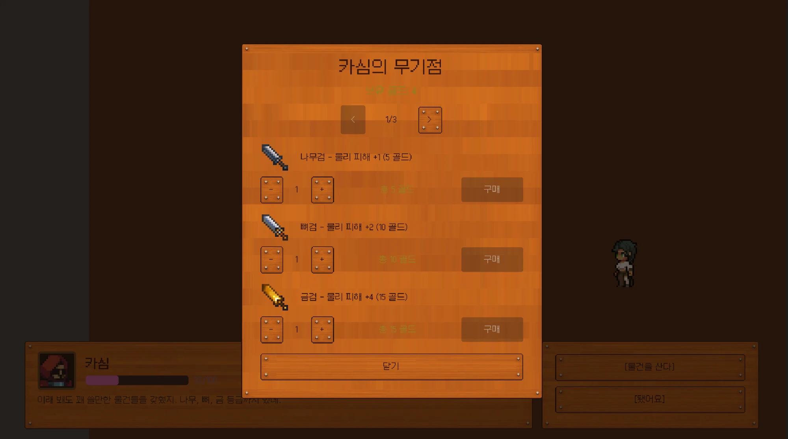
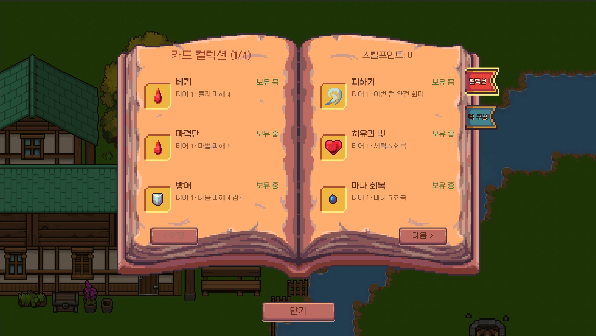
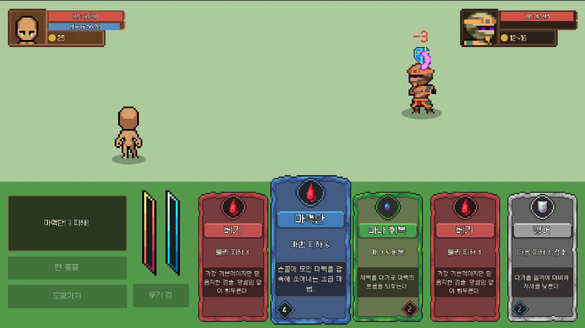
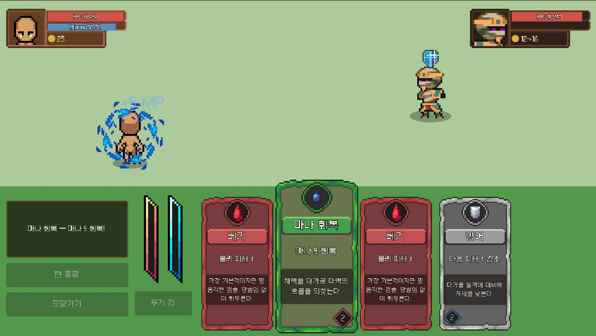
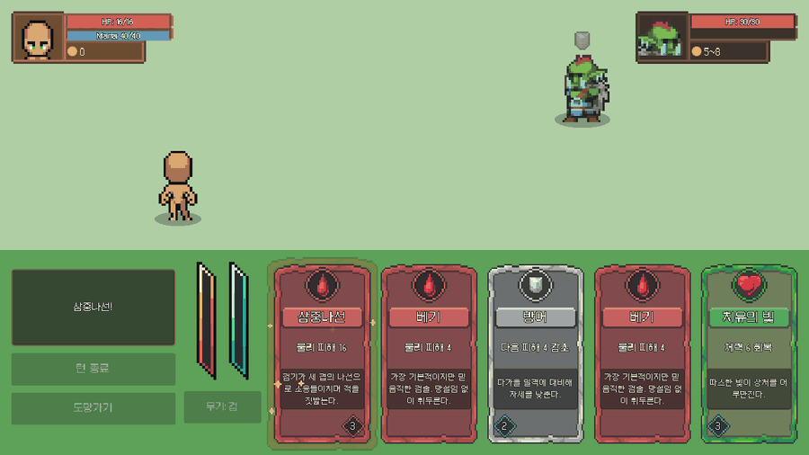
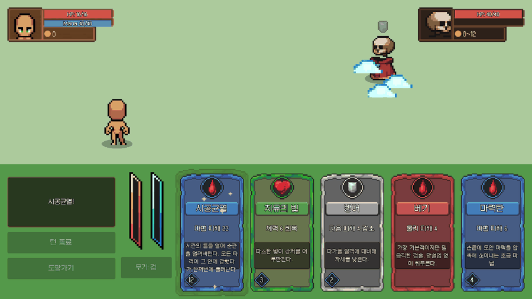

# Project JRPG

A small 2D top-down JRPG built in Godot 4.7, developed as a solo learning
project to understand and implement core CS concepts — particularly
**state management** — from scratch.

## Why this project

I got into playing open-world RPGs since childhood, and what pulled me in
wasn't just the combat or graphics but how the world seemed to *remember*
what I did and react to it. NPCs referenced past choices, areas changed
based on progress. I wanted to understand how that actually works under
the hood, which is part of what led me to study CS.

In high school I built a visual novel with branching choices in Ren'Py,
but never implemented a system that accumulated state across choices —
that was a skill gap, not a tool limitation. This project is a direct
attempt to close that gap by designing a state system myself.

The full world/story design is documented in [docs/world.md](docs/world.md).

## Goals

This is not meant to be a polished commercial game. The goal is a small,
**finished** project that demonstrates:
- A self-designed state management system (Autoload singleton + signal-based
  flag system)
- NPC dialogue that reacts to accumulated player state
- Branching choices and multiple endings
- A minimal turn-based combat system tied to optional side quests

Once the basic state-management system (movement, dialogue, save/load) was
working and validated, I deliberately expanded the combat system further —
adding a card deck, weapon overheat gauges, tiered equipment, and a
skill-point unlock system — specifically as practice for designing more
complex, interdependent state.

## Tech stack

- **Engine:** Godot 4.7 (GDScript)
- **Architecture:** Autoload singletons for cross-scene state (`GameState`,
  `SaveManager`, `SceneManager`, `MusicManager`, `SFXPlayer`), Resource-based
  data files for content (cards, endings) so new content doesn't require
  code changes
- **Assets:** Free and licensed pixel-art/audio packs from several itch.io
  creators (world tiles, items, icons, cards, music, SFX); a few packs are
  licensed and not redistributed (excluded via `.gitignore`) — full credits
  and license status in the Assets section below
- **AI tooling:** Claude Code used as an implementation/debugging assistant.
  All architectural decisions (state structure, signal design, system
  scope) are made by me first; Claude Code implements based on those
  decisions.

## Assets & Credits

License status below reflects only what's stated in each pack's own bundled
files (checked directly, not assumed from memory). Where a pack has no
bundled license/readme/terms file, or the itch.io link couldn't be
confirmed from the bundled files, that's noted explicitly rather than
guessed.

- **Pixel Crawler - Free Pack** — Anokolisa (itch.io) — bundled `Terms.txt`
  allows commercial and non-commercial use, credit appreciated but not
  required, no reselling. **Not CC0** — this repo previously said CC0,
  which the bundled file doesn't actually support; corrected here.
  https://anokolisa.itch.io — itch.io link inferred from the author
  name in `Terms.txt`, not written verbatim in the file; please confirm
- **Pixel Crawler - Desert** — Anokolisa (itch.io) — same `Terms.txt` as
  above. Licensed pack, not redistributed (excluded via `.gitignore`).
  https://anokolisa.itch.io — same caveat as above
- **16x16 RPG Assets** — ssugmi (itch.io) — bundled `README.txt` allows
  commercial and non-commercial use, no reselling/redistribution, credit
  appreciated but not required.
  https://ssugmi.itch.io — this URL is written verbatim in the
  bundled file
- **Raven Fantasy Icons** — Clockwork Raven (itch.io) — no license/terms
  file bundled with this pack; the only bundled text file is a personal
  thank-you note with no license terms. Terms not verified from local
  files.
  no confirmed link — itch.io slug not found in any bundled file
- **Card Game Layout Template** — guawoo (itch.io) — no license file
  bundled with this pack. Terms not verified from local files.
  https://guawoo.itch.io — link inferred from the name given above,
  not confirmed from a bundled file
- **Character Footsteps pack** — Nebula Audio (itch.io) — no license file
  bundled with this pack. Terms not verified from local files.
  no confirmed link — multi-word name, itch.io slug not guessed
- **Dialogue Bleeps Pack** — dmochas (itch.io) — no license file bundled
  with this pack. Terms not verified from local files.
  https://dmochas.itch.io — link inferred from the name given above,
  not confirmed from a bundled file
- **"16-Bit Fantasy & Adventure Music"** — Marllon Silva / xDeviruchi
  (itch.io / YouTube) — bundled `DOCUMENTATION & LICENSE.pdf` allows
  commercial and non-commercial use and modification, but **requires
  attribution**, worded exactly as: "Original music by Marllon Silva
  (xDeviruchi)". Original files are not redistributed as standalone
  assets.
  no confirmed itch.io/YouTube URL text found in the PDF
- **400 Sounds Pack** — ci (itch.io) — no license file bundled with this
  pack. Terms not verified from local files.
  https://ci.itch.io
- **Basic Pixel Health Bar and Scroll Bar** — bdragon1727 (itch.io) — no
  license file bundled with this pack. Also, which files in this repo
  actually come from this pack couldn't be confirmed from bundled
  documentation — best guess is the loose numbered gauge-sheet images in
  `assets/GUI/`, based only on a code comment, not on any pack
  documentation.
  https://bdragon1727.itch.io — link inferred from the name given
  above, not confirmed from a bundled file
- **750 Effect and FX Pixel All** — bdragon1727 (itch.io) — no license
  file bundled in `assets/vfx/`. Licensed pack, not redistributed
  (excluded via `.gitignore`).
  https://bdragon1727.itch.io — same caveat as above
- **Mona Font** — MonadABXY — bundled `LICENSE/mona.txt` contains the full
  SIL Open Font License 1.1 text. Note: the license file itself points to
  https://monadabxy.com, not GitHub.
- **RPG UI Pack** — Franuka (itch.io) — bundled `License and details.txt`
  allows commercial and non-commercial use, credit appreciated but not
  required, no redistribution/resale. Licensed pack, not redistributed
  (excluded via `.gitignore`).
  https://franuka.itch.io — this URL is written verbatim in the
  bundled file
- **UI User Interface Pack (Medieval)** — ToffeeCraft (itch.io) — no
  license file bundled with this pack. Licensed pack, not redistributed
  (excluded via `.gitignore`).
  https://toffeecraft.itch.io — link inferred from the name given
  above, not confirmed from a bundled file

See the Screenshots section below for how the interface actually looks.

## Progress

**Core systems**
- [x] 4-directional player movement + locked camera
- [x] Sprite animation (walk/idle, 4 directions) with pixel-art filtering
- [x] Scene/map transitions across 6+ zones (village, forest, cave, desert,
  ruins, tavern, connected by a dock)
- [x] State management system (Autoload, flag-based, signal-driven)
- [x] 5-slot save/load (full state restore: flags, quests, gold, inventory,
  affinity, unlocked cards, custom deck, player position)
- [x] Title screen (new game / load / ending record) and opening cutscene

**Story & dialogue**
- [x] NPC dialogue reacting to accumulated state (7 NPCs: Elara, Rohan,
  Yusuf, Mia, Kamil, Nadim, Kasim), branching + gossip system
- [x] Per-NPC affinity system (0-100, shifts with dialogue choices) driving
  dialogue tone and high-affinity content
- [x] Two-part branching story (Part 1: village/forest/cave; Part 2:
  desert/ruins) with decisive choices and **5 endings**, tracked in an
  in-game ending-record codex separate from save slots

**Combat**
- [x] Turn-based card combat: draw/hand/play loop, 22 cards across 3 tiers
- [x] Weapon overheat gauges (sword/staff, accumulate on use, gate which
  cards are safe to play)
- [x] Tiered equipment (sword/staff/shield × wood/bone/gold, 9 pieces)
  purchasable from a dedicated weapon shop
- [x] Skill-point unlock system: cards above the starting 6 are unlocked
  with points earned from leveling up
- [x] Spellbook UI with a card-collection view and a deck-builder tab for
  assembling a custom deck
- [x] Per-card VFX/SFX, including six cards with fully custom multi-hit
  "cutscene" animations (flash slash, triple helix, swift, meteor drop,
  time rift, judgment)
- [x] Item shop (potions, gift item) separate from the weapon shop
- [x] Side quests tied to specific monster encounters, gating story progress

**Not done**
- [ ] Additional playable classes (stretch goal, not started)
- [ ] Kasim's max-affinity gift-back content (documented in
  [docs/world.md](docs/world.md), not yet implemented)

## Screenshots

**Exploration & dialogue**

_Overworld exploration: HP/mana HUD, quest tracker, and an NPC interaction prompt._

_NPC dialogue with a visible affinity bar and branching choices._

**Shops**

_Yusuf's item shop — potions and a gift item, bought with quantity steppers._

_Kasim's weapon shop — tiered equipment (wood/bone/gold) across paginated pages._

**Cards & battle**

_Spellbook collection view, showing owned tier-1 cards and current skill points._

_A battle in progress: 5-card hand, weapon-overheat gauges, and a damage popup._

_Per-card VFX: a mana-restore swirl plays around the player on cast._

**More combat cutscenes**

_삼중나선 (Triple Helix) — a multi-hit tier-3 physical cutscene, vs. an orc._

_시공균열 (Time Rift) — a tier-3 magic cutscene, vs. a skeleton._

## Scope notes

Basic systems (movement, dialogue, state management, save/load) were built
and validated first. Once that foundation held up, I deliberately expanded
the combat system — card deck, weapon overheat gauges, equipment tiers,
skill-point unlocks — as a further exercise in designing more complex,
interdependent state, rather than stopping at the minimum needed to prove
the concept.

Maps and battle backgrounds are still visually minimal — the project's
focus is system design, not visual art, so art direction was deliberately
deprioritized. Ideas beyond current scope (additional classes, larger side
content) are tracked as a post-v1.0 roadmap in
[docs/world.md](docs/world.md) rather than added mid-development.
