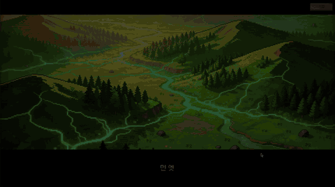
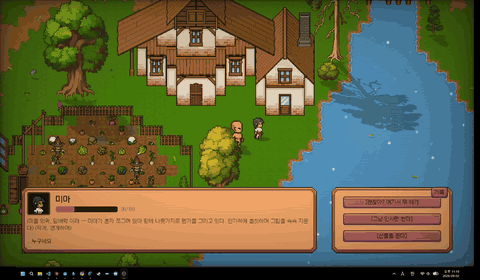
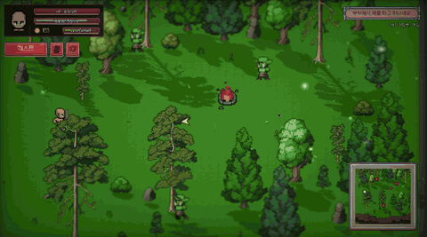
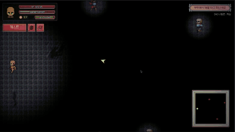
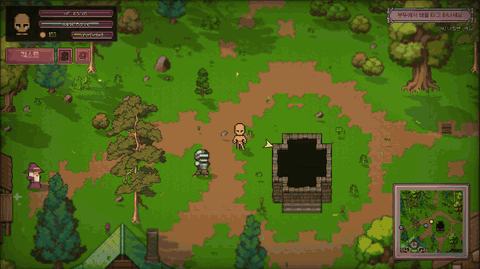
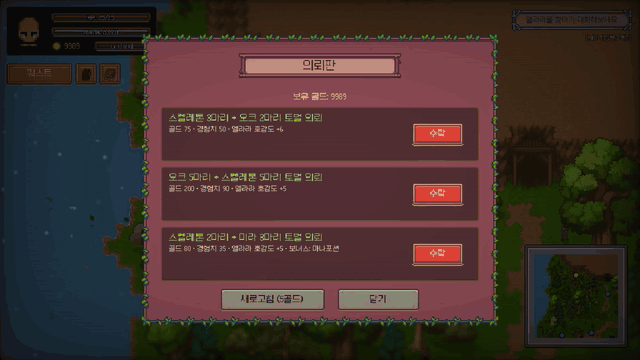
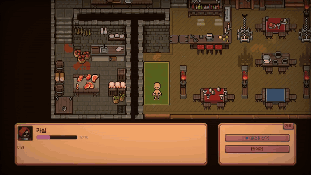
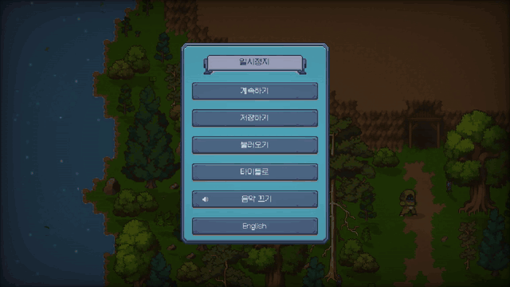
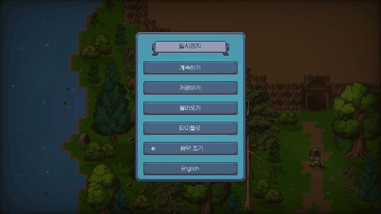

# Project_JRPG

This is 2D open-world JRPG where your choices change your world. Every decision contributes to the state system that shapes how NPCs treat you, which story branches open up, and which ending you land on.

## What is this

Project_JRPG is an open-world JRPG built in Godot. You can explore small 2d pixel world, fight in turn-based card battles, talk to NPCs to earn affinity, take on different quests, and make choices that actually carry weight. The game tracks what you've done through a flag-based state management system, and the story (Part 1 and Part 2 so far, 5 endings) branches based on that history.

## Why I built this

In high school, I made a branching visual novel in Ren'Py. The problem was that every choice only changed the very next line, or which ending screen you hit at the end. Nothing really carried across the story. I wanted to fix that, but not by making a better visual novel game. I wanted a real game with full movement, combat, inventory, dialogue, all of it, with a state system running underneath that actually remembers what you did, all the way through.

That's what this is. The state management system was never the end goal by itself — it's what makes the story worth playing more than once.

## Features

### Open-world exploration
Village, forest, desert, dungeons, and cave areas connected through a scene transition system, with basic exploration elements like hidden chests and interactable NPCs. (I have plans to build out deeper sub-quests and more interactive environment mechanics in future updates.)

### State-driven dialogue & NPCs

Seven NPCs (Elara, Rohan, Yusuf, Mia, Kamil, Nadim, Kasim), each with a 0-100 affinity score that shifts based on dialogue choices and drives their tone and which content opens up — not just whether you finished a specific quest, but the accumulated pattern of what you did.

### Turn-based card combat

22 cards across 3 tiers, weapon overheat gauges, tiered equipment, multi-enemy fights, and buffs/debuffs. Six of the tier-3 cards have fully custom multi-hit cutscene animations.

### Skills, equipment, and inventory

A skill-point-based deck builder for combat cards, plus an equipment/inventory system for swapping gear.

### Quests & the bounty board

Pick up bounty-board requests and track them through a dedicated quest log.

### Shops

NPC-run shops for buying gear and supplies.

### Settings: language & audio

Audio control and full Korean/English localization with a toggle (English translation is currently machine-translated and still very much a W.I.P!)

## Tech stack

- **Godot 4.7**, GDScript
- Chose Godot over Unity/Unreal because GDScript's syntax is close to Python — less time learning a new language, more time on the actual state logic
- **State management**: an autoload singleton (`GameState`) holding a flag dictionary and firing signals, which the rest of the game reacts to. Other autoloads (`SaveManager`, `SceneManager`, `MusicManager`, `SFXPlayer`) handle their own slice of cross-scene state
- Content (cards, endings) lives in Resource files, so adding new content doesn't require touching code
- **Localization**: dialogue text keyed by id with a translation overlay, UI strings through Godot's `tr()`
- **AI tooling**: I used Claude Code as an implementation and debugging assistant. Architecture and design decisions (state structure, signal design, system scope) are mine; Claude Code builds from those decisions

## Progress

**Core systems**
- [x] 4-directional movement + camera
- [x] Scene/map transitions across 6+ zones (village, forest, cave, desert, ruins, tavern)
- [x] Flag-based state management (Autoload, signal-driven)
- [x] 5-slot save/load (flags, quests, gold, inventory, affinity, unlocked cards, custom deck, position)
- [x] Title screen and opening cutscene

**Story & dialogue**
- [x] NPC dialogue reacting to accumulated state, branching + gossip system
- [x] Per-NPC affinity system driving dialogue tone and high-affinity content
- [x] Two-part branching story (Part 1: village/forest/cave; Part 2: desert/ruins) with 5 endings, tracked in an in-game codex

**Combat**
- [x] Turn-based card combat: draw/hand/play loop, 22 cards across 3 tiers
- [x] Weapon overheat gauges, tiered equipment, skill-point unlock system
- [x] Spellbook UI: card collection view + deck-builder tab
- [x] Per-card VFX/SFX, tier-3 cards with custom cutscene animations
- [x] Side quests tied to specific monster encounters, gating story progress

**Not done yet**
- [ ] Additional playable classes (stretch goal)

## Roadmap

- Part 1 and Part 2 are done. Preparing a demo release on Steam and itch.io.
- Next up is a side project called **AI in NPC** — using something like Inworld AI to build an NPC whose responses aren't pre-written branches, but generated live based on what you actually say. The plan is to make one prototype and use that AI-driven NPC into Project_JRPG as an experiment, kept outside the main story and endings at first — just a resident/helper character, to test the idea without risking the rest of the game.
- The bigger goal past that isn't really Project_JRPG itself. It's working toward a future game where AI genuinely shapes the world and the ending based on how you play, instead of picking between paths I wrote in advance. This project, and the AI NPC experiment after it, are both steps toward that.
- Full Steam release planned for next year.

## Assets & Credits

License status below reflects what's actually stated in each pack's own bundled files (checked directly, not assumed from the itch.io page). Where a pack has no bundled license/readme/terms file, that's noted explicitly rather than guessed.

- **Free Pixel Art Asset Pack – Topdown Tileset RPG 16x16** — Anokolisa (itch.io) — bundled `Terms.txt` allows commercial and non-commercial use, credit appreciated but not required, no reselling. Not CC0.
  https://anokolisa.itch.io/free-pixel-art-asset-pack-topdown-tileset-rpg-16x16-sprites
- **Pixel Crawler – Desert** — Anokolisa (itch.io) — same `Terms.txt` as above. Paid pack, not redistributed (excluded via `.gitignore`).
  https://anokolisa.itch.io/pixel-crawler-desert
- **16x16 RPG Assets** — ssugmi (itch.io) — bundled `README.txt` allows commercial and non-commercial use, no reselling/redistribution, credit appreciated but not required.
  https://ssugmi.itch.io/16x16-rpg-assets
- **Raven Fantasy Icons** — Clockwork Raven (itch.io) — no license/terms file bundled; terms not independently verified.
  https://clockworkraven.itch.io/raven-fantasy-icons
- **Card Game Layout Template** — guawoo (itch.io) — no license file bundled; terms not independently verified.
  https://guawoo.itch.io/card-game-layout-template
- **Character Footsteps: Rock, Grass Pack 1** — Nebula Audio (itch.io) — no license file bundled; terms not independently verified.
  https://nebula-audio.itch.io/character-footsteps-rock-grass-pack-1
- **Dmocha's Bleeps Pack** — dmochas-assets (itch.io) — no license file bundled; terms not independently verified.
  https://dmochas-assets.itch.io/dmochas-bleeps-pack
- **16-Bit Fantasy & Adventure Music Pack** — Marllon Silva / xDeviruchi (itch.io / YouTube) — bundled `DOCUMENTATION & LICENSE.pdf` allows commercial and non-commercial use and modification, but **requires attribution**, worded exactly as: "Original music by Marllon Silva (xDeviruchi)".
  https://xdeviruchi.itch.io/16-bit-fantasy-adventure-music-pack
- **400 Sounds Pack** — ci (itch.io) — no license file bundled; terms not independently verified.
  https://ci.itch.io/400-sounds-pack
- **Basic Pixel Health Bar and Scroll Bar** — bdragon1727 (itch.io) — no license file bundled; terms not independently verified.
  https://bdragon1727.itch.io/basic-pixel-health-bar-and-scroll-bar
- **750 Effect and FX Pixel All** — bdragon1727 (itch.io) — no license file bundled. Not redistributed (excluded via `.gitignore`).
  https://bdragon1727.itch.io/750-effect-and-fx-pixel-all
- **Falling Leaf FX** — rs-pixel-store (itch.io) — listed as free for commercial use with optional credit at time of download; no bundled license file remains locally to re-verify against.
  https://rs-pixel-store.itch.io/falling-leaf-fx
- **Wind Sound Effect** — neptune-ringgs (itch.io) — listed as free for commercial use with optional credit at time of download; no bundled license file remains locally to re-verify against.
  https://neptune-ringgs.itch.io/wind-sound-effect
- **Mona Font** — MonadABXY — bundled `LICENSE/mona.txt` contains the full SIL Open Font License 1.1 text.
  https://github.com/MonadABXY/mona-font
- **RPG UI Pack** — franuka (itch.io) — bundled `License and details.txt` allows commercial and non-commercial use, credit appreciated but not required, no redistribution/resale. Paid pack, not redistributed (excluded via `.gitignore`).
  https://franuka.itch.io/rpg-ui-pack
- **UI User Interface Pack (Medieval)** — ToffeeCraft (itch.io) — no license file bundled. Paid pack, not redistributed (excluded via `.gitignore`).
  https://toffeecraft.itch.io/ui-user-interface-pack-medieval

Vignette shader sourced from [godotshaders.com](https://godotshaders.com), CC0 licensed.
